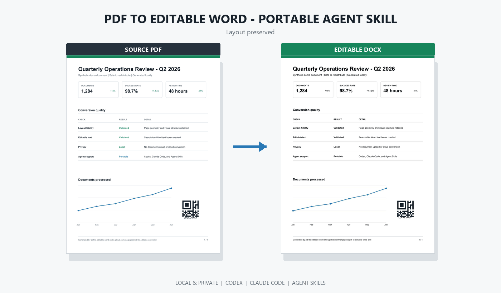

# PDF 转可编辑 Word Skill - 保留排版的跨 Agent PDF-to-DOCX 工具

[English](README.md) | [简体中文](README.zh-CN.md)

[](https://github.com/longligooo/pdf-to-editable-word-skill/actions/workflows/ci.yml)
[](https://github.com/longligooo/pdf-to-editable-word-skill/releases/latest)
[](https://www.python.org/)
[](LICENSE)

这是一个可跨 Agent 安装的 **PDF 转 Word Skill**：将 PDF 转为文字可搜索、可选择、可编辑的 Word（DOCX），同时尽量保持原始页面排版。支持 **Codex、Claude Code、通用 Agent Skills**，也可以脱离 Agent 直接使用本地 CLI。

- **排版保真：** 页面边框、表格线、图片、二维码和视觉结构保留在背景层。
- **文字可编辑：** PDF 文字按原坐标重建为 Word 文本框。
- **本地隐私：** 文档不会上传到在线转换服务。
- **跨 Agent：** 同一份 `SKILL.md` 可安装到不同 Agent。

> 当前为 Alpha 版本，适合自带文字层的 PDF，并优先兼容桌面版 Microsoft Word。纯扫描 PDF 暂不支持 OCR。



演示完全使用可公开分发的合成数据，并通过 Microsoft Word 真实渲染。转换后生成 `37` 个可编辑文本框，随后直接在 DOCX 中把 `Q2` 改为 `Q3`、把 `48 hours` 改为 `24 hours`。

[下载源 PDF](examples/demo-source.pdf) | [下载可编辑 DOCX](examples/demo-output.docx) | [下载编辑后的 DOCX](examples/demo-edited.docx)

## 60 秒安装 Skill

先安装 Python 3.10+、[pipx](https://pipx.pypa.io/) 和 [Poppler](https://poppler.freedesktop.org/)（确保 `pdftoppm` 在 `PATH` 中）：

```bash
pipx install https://github.com/longligooo/pdf-to-editable-word-skill/releases/download/v0.1.0/pdf_to_editable_word-0.1.0-py3-none-any.whl
pdf2word doctor

# 按使用的 Agent 选择一个
pdf2word skill install --agent codex
pdf2word skill install --agent claude
```

其他支持 Agent Skills 的工具可以指定 skills 目录：

```bash
pdf2word skill install --destination /path/to/agent/skills
```

然后直接告诉 Agent：

```text
把 report.pdf 转为可编辑 Word，保持原始排版，完成后校验结果，
并告诉我哪些页面需要人工检查。
```

没有 `pipx` 时，可以直接从 GitHub 安装：

```bash
python -m pip install "https://github.com/longligooo/pdf-to-editable-word-skill/releases/download/v0.1.0/pdf_to_editable_word-0.1.0-py3-none-any.whl"
```

Ubuntu/Debian 使用 `sudo apt-get install poppler-utils` 安装 Poppler。Windows 用户需要将 `pdftoppm.exe` 加入 `PATH`，或设置 `PDFTOPPM` 环境变量。

## 直接使用 CLI

```bash
pdf2word inspect input.pdf
pdf2word convert input.pdf output.docx
pdf2word validate output.docx --pdf input.pdf
```

长文档中断后可以续跑：

```bash
pdf2word convert input.pdf output.docx --work-dir .pdf2word-work/input --resume
```

## 工作原理

1. 从 PDF 文字层提取文字、坐标、字号和颜色。
2. 渲染原始页面，并擦除背景图中的原文字区域。
3. 将处理后的页面作为 Word 背景。
4. 按 PDF 坐标叠加可编辑 Word 文本框。
5. 校验页数、背景图、文本框和可编辑文字数量。

非文字内容保留在背景图中，因此视觉结构稳定；文字则保持可编辑。

## 已知限制

- 纯扫描 PDF 需要 OCR，当前版本尚未包含。
- 文字可编辑；表格线、图片和图形仍属于页面背景，并非语义化 Word 对象。
- 彩色或纹理背景上的文字擦除区域可能可见。
- 混合页面尺寸会被主动拒绝，避免生成错误文档。
- DOCX 使用 VML 文本框，优先兼容 Microsoft Word；LibreOffice 可能出现差异。
- 查看端缺少源字体时，Word 可能执行字体替换。

## 开发与测试

```bash
python -m pip install -e ".[dev]"
python scripts/sync_bundled_skill.py
python -m unittest discover -s tests -v
```

测试 PDF 全部在运行时使用合成数据生成，仓库不包含有版权或私密文档。

## License

MIT。Poppler 是外部运行依赖，本仓库不分发 Poppler。
